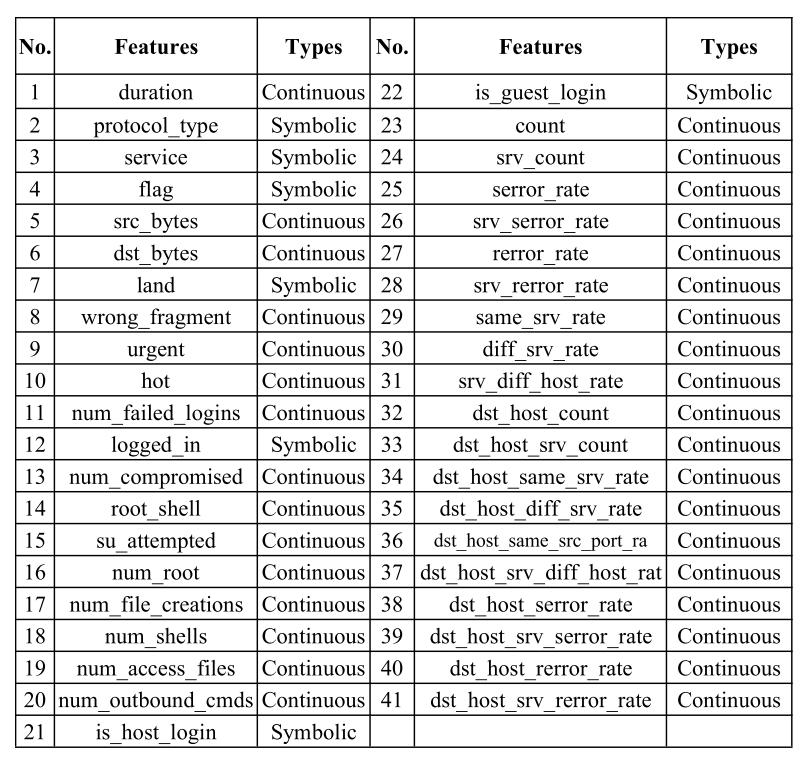

# A Deep Learning Approach for Intrusion Detection Using Recurrent Neural Networks

## Authors
CHUANLONG YIN , YUEFEI ZHU, JINLONG FEI, AND XINZHENG HE

## Conference
AAAI Access 5, 2017

## Resume
This paper uses RNN (recurrent neural networks) to do intrusion detection. In fact, the authors believe that the detection task can be 
viewed as classification tasks. Each trafic record can be classified into `yes` or `no`. Further more, in this paper, there are several
types of intrusions:
* DoS (Denial of Service attacks)
* R2L (Root to Local attacks)
* U2R (User to Root attack)
* Probe (Probing attacks)
Thus, there are finally 5 type of results: Not an intrusion, DoS, R2L, U2R, and Probe.

Then we use RNN to do this. The dataset in this paper is NSL-KDD. Each trafic record has 41 features:

