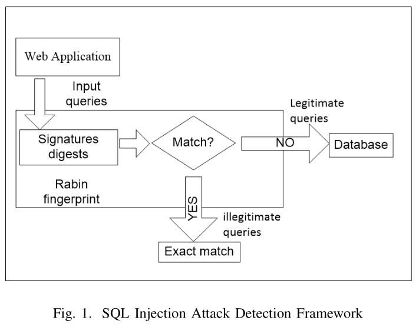

# Review: SQL injection attack detection using fingerprints and pattern matching technique

## Author: Benjamin Appiah, Eugene Opoku-Mensah and Zhiguang Qin

## Institution: UESTC, Chengdu

## Date: 2017 ICSESS

## Reviewer: Yixiao FEI

​    SQL Injection Attack is at peak among online attacks. This paper proposed signature-based SQL injection attack detection framework by integrating fingerprinting method and Pattern Matching to distinguish genuine SQL queries from malicious queries. Besides, the Aho-Corasick algorithm is invoked to ascertain whether attack signatures appear in the queries if the previous method fails.

​    Different types of SQL Attacks were defined in the paper. They used attack tools to generate dataset. After removing duplicates, a dataset consisting of 527 injected tokens and 343 genuine tokens were prepared.

​    A trade-off exist between processing rate and memory consumption in our framework. Injected queries detection could be improved with a large signature database that reduces fingerprint collisions at the cost of increasing memory.

​    Pattern Matching techniques such as Boyer Moore and Aho Corasick algorithm has been employed in detection attacks before they are being passed to the database. The latter are more computationally intensive and produces much false positive and false negatives as attackers are easily ably to circumvent. The experimental results confirm that the approach is effective in detecting all types of SQLIA with low false positive rate. Finally, the difficulty identifying unknown attack using signature-based detection systems