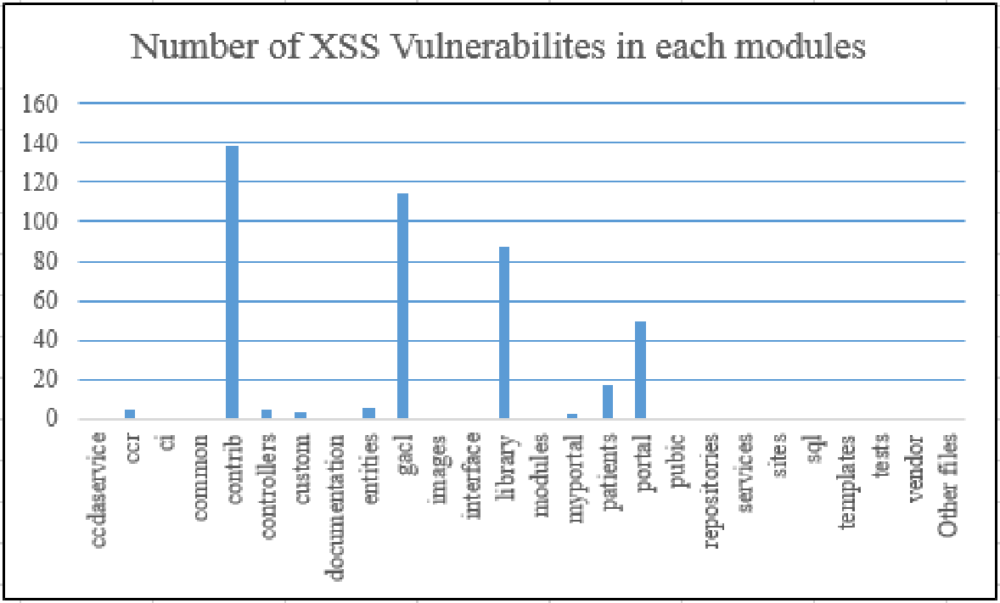

# Review: Security Patterns As Architectural Solution Mitigating Cross-Site Scripting Attacks in Web Applications

## Author: Priya Anand, Jungwoo Ryoo 

## Institution: Pennsylvania State University

## Date: 2017 ICSSA

## Reviewer: Yixiao FEI

​    Software system suffers often vulnerabilities and it is hard to implement security module for the system. This paper proposed a tool named SPAAS (Security Patterns As Architectural Solution) which would automate the process of implementing the selected security pattern in the software system at an architectural level. The tool serves as a scanner for a selected type
of vulnerability and reports the vulnerable spots in the system.

​    In this project, they evaluated the presence of XSS vulnerabilities in a particular file on OpenEMR projects as reported in the project’s GitHub repository. 

​    The tool can help  vulnerability scanners like IBM AppScan, Nessus and Qualys, but in its current version, it is limited to assessing vulnerabilities in a particular programming
language. The tool now implements a particular pattern (Intercepting Validator Pattern) but cannot support implementing more security patterns.