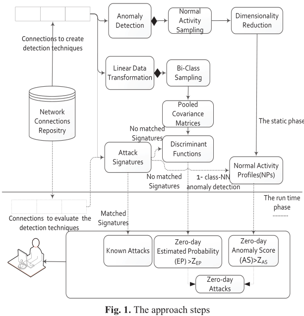
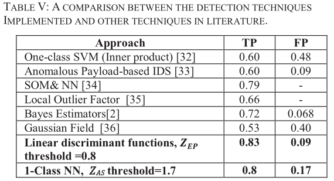

# Review: Toward Zero-day Attack Identification Using Linear Data Transformation Techniques

## Author: Ahmed AlEroud, George Karabatis

## Institution: University of Maryland

## Date: 2013 IEEE

## Reviewer: Yixiao FEI

Intrusion Detection Systems (IDSs) have been developed for many years, but in general they fall short in efficiently detecting zero-day attacks. Critical points for an IDS: False alert rate, Contextual information fusion, Computational complexity of the detection process. The article proposes an
approach that applies linear data transformation and anomaly detection techniques on top of attack signatures.

The approach consists of two phases, the pre-processing (static) phase, during which data are being used to create intrusion detection models ahead of time that will be used in the next phase; and the detection (run-time) phase, during which, detection techniques are applied on a network connection, analyze it, and determine whether it is a known, a zero-day attack, or a normal activity.

​    The linear data transformation technique relies on several discriminant functions, which are used to calculate the estimated probability of zero-day attacks by analyzing network connection features. The anomaly detection technique identifies zero-day attacks using the One Class Nearest Neighbor (1-class NN) algorithm, which has been applied using Singular Value Decomposition (SVD) technique to achieve dimensionality reduction.

​    The experimental results indicate that linear data transformation, when applied on network data, are quite effective and efficient in detecting zero-day attacks than the typical density based anomaly detection techniques.

