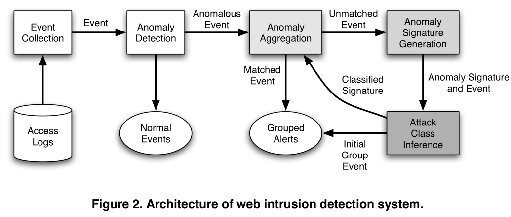

# Review: Using Generalization and Characterization Techniques in the Anomaly-based Detection of Web Attacks

## Author: William Robertson, Giovanni Vigna, Christopher Kruegel, and Richard A. Kemmerer

## Institution: University of California

## Date: 2006 NDSS

## Reviewer: Yixiao FEI

​    While the developers of the software infrastructure usually have a deep understanding of the security issues associated with the development of critical software, the developers of web-based applications often have little or no security skills. Web-related security flaws represent a substantial portion of the total number of vulnerabilities.

​    The paper proposed an “anomaly signature” that is used to identify further occurrences of similar anomalies. Similar anomalies are grouped together and are then analyzed by the administrator to determine if each group, as a whole, is composed of false positives or actual attacks. They also developed heuristics that can identify common classes of attacks, such as buffer overflows, cross-site scripting, SQL injection, and directory traversals.

​    Generalization is used to create a more abstract description of an anomaly that enables one to
group similar attacks. Characterization is used to infer the class of attack that is associated with a group of anomalies. They tested it on real-world data collected at two universities. The results shows that the proposed techniques are able to correctly generalize and characterize attacks, considerably reducing the effort needed to analyze the output of the intrusion detection system. The paper has listed all the aspects that the detection model covers but it seemed that the model structure was not so clear.