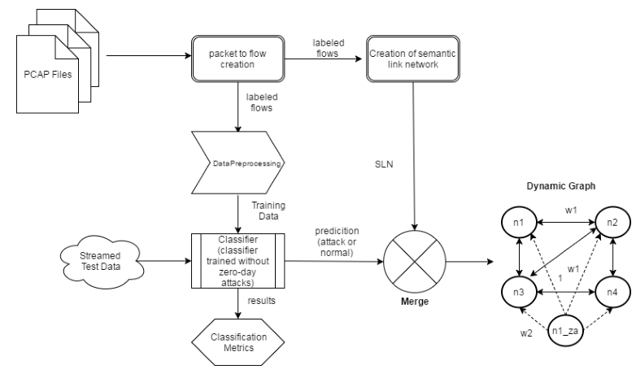

# Review: Zero-day Attack Identification in Streaming data using Semantics and Spark

## Author: Sai C. Pallaprolu, Rishi Sankineni, Muthukumar Thevar, George Karabatis, Jianwu Wang

## Institution: University of Maryland

## Date: 2017 IEEE 6th International Congress on Big Data

## Reviewer: Yixiao FEI

​    Intrusion Detection Systems (IDS) have been in existence for many years now, but they fall short in efficiently detecting zero-day attacks. This paper presents an organic combination of Semantic Link Networks (SLN) and dynamic semantic graph generation for the on the fly discovery of zero-day attacks using the Spark Streaming platform for parallel detection.

​    The article proposed to train the classifier as usual which is based on KNN and in addition created a semantic link network which is actually a graph of sample relations. The nodes would be either attacks or normal access and the edge weight represents the similarity between two nodes. The SLN would update itself after detecting a zero-day attack.

​    Compared to previous studies on zero-day attack identification, the described method
yields better results due to the semantic learning and reasoning on top of the training data and due to the use of collaborative classification methods. The article has applied many machine learning techniques such as data preprocessing and dimension reduction. The largest innovative point might be the SLN which might just be a graph representation of the classes. 